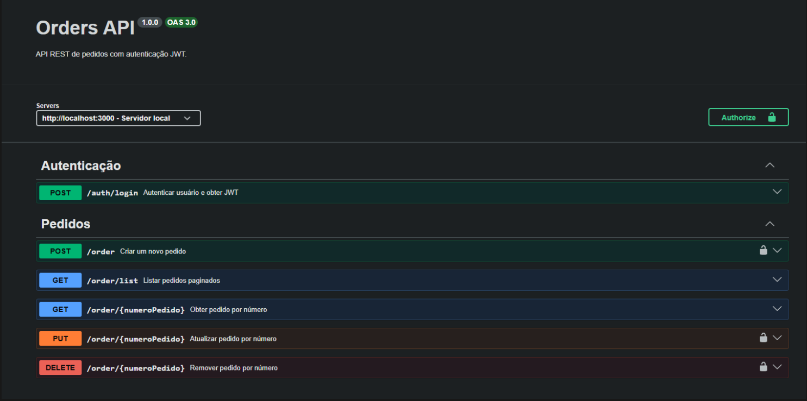
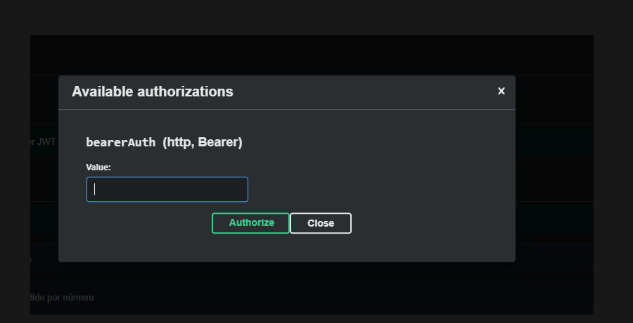
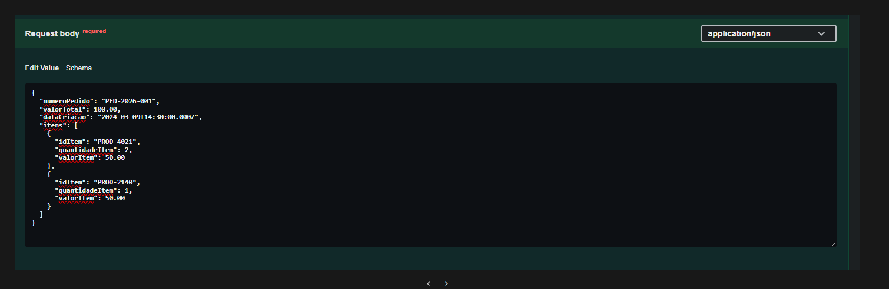
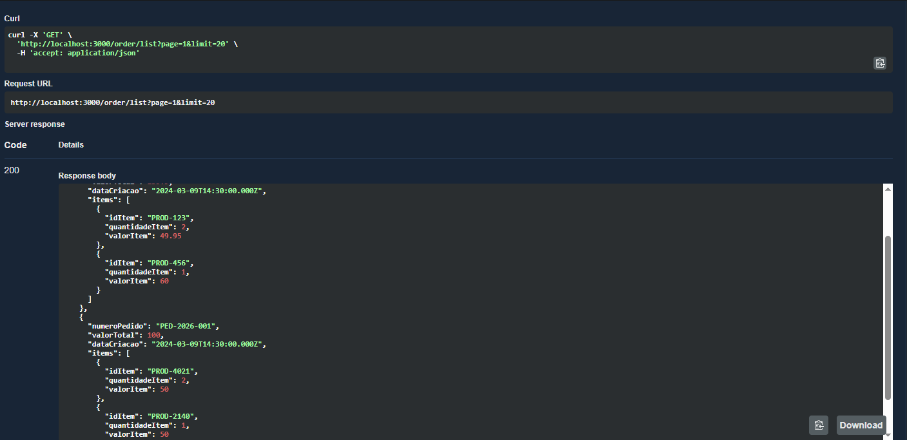
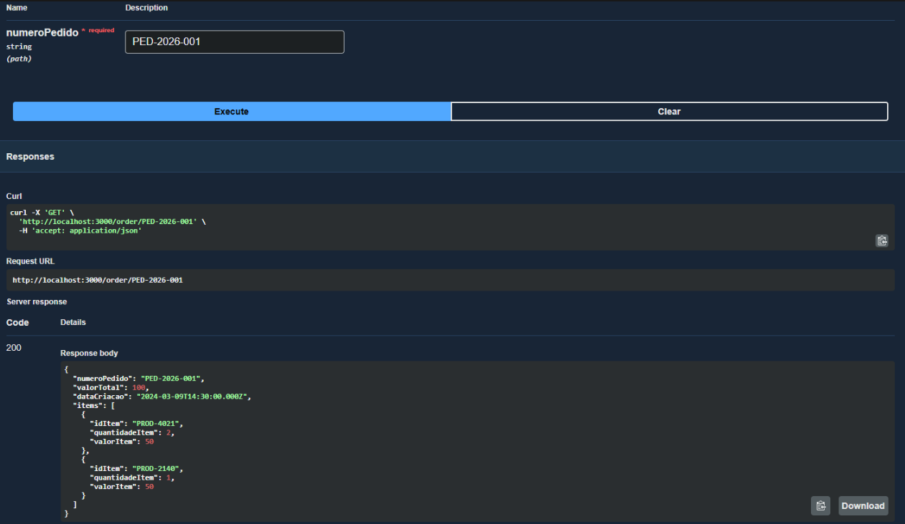

# Orders API

API REST de pedidos com autenticação JWT. Permite criar, listar, buscar, atualizar e excluir pedidos com itens.

---

## Como executar

### Pré-requisitos

- **Node.js** (v18 ou superior)
- **PostgreSQL** (v14+) ou **Docker** para subir o banco

### Variáveis de ambiente

Crie um arquivo `.env` na raiz do projeto. Exemplo:

```env
# Servidor
PORT=3000
NODE_ENV=development

# Banco (valores padrão batem com o docker-compose)
DB_HOST=localhost
DB_PORT=5432
DB_NAME=orders_db
DB_USER=order_user
DB_PASSWORD=order_password

# Autenticação
AUTH_USERNAME=admin
AUTH_PASSWORD=admin123
JWT_SECRET=seu-secret-aqui
JWT_EXPIRES_IN=1h
```

### Banco de dados

Com Docker:

```bash
docker-compose up -d
```

Execute as migrations manualmente no PostgreSQL (arquivos em `migrations/`), por exemplo com `psql` ou um cliente gráfico:

```bash
psql -h localhost -U order_user -d orders_db -f migrations/001_create_orders_and_items.sql
```

### Instalação e execução

```bash
npm install
npm run dev
```

A API sobe em **http://localhost:3000**. Em produção: `npm start`.

---

## Documentação interativa (Swagger)

Com a API rodando, a documentação Swagger fica em:

**http://localhost:3000/docs**

Lá você pode ver todos os endpoints e testar as requisições direto no navegador.

### 1. Visão geral do Swagger

Tela inicial com título "Orders API", seções **Autenticação** e **Pedidos** e a lista de endpoints. Salve como `docs/screenshots/01-swagger-overview.png`.



### 2. Authorize (token JWT)

Modal onde se cola o token obtido no login. Salve como `docs/screenshots/02-swagger-authorize.png`.



### 3. POST /auth/login

*(Opcional: capture o endpoint expandido com body e resposta 200. Salve como `docs/screenshots/03-auth-login.png`.)*


### 4. POST /order (criar pedido)

Body de exemplo e resposta 201. Salve como `docs/screenshots/04-post-order.png`.



### 5. GET /order/list (listagem paginada)

Parâmetros `page` e `limit` e resposta 200. Salve como `docs/screenshots/05-get-order-list.png`.



### 6. GET /order/{numeroPedido} (buscar por número)

Path parameter e resposta 200. Salve como `docs/screenshots/06-get-order-numero.png`.



### 7. PUT e DELETE (endpoints protegidos)

PUT e DELETE com cadeado de autenticação. Salve como `docs/screenshots/07-put-delete.png`.


---

## Autenticação

- **Login:** `POST /auth/login` com `username` e `password` no body. A resposta traz um `token` JWT e `tipo: "Bearer"`.
- **Rotas protegidas:** Para criar, atualizar ou excluir pedidos, envie o token no header:
  ```http
  Authorization: Bearer <token>
  ```
- No Swagger: use o botão **Authorize**, cole só o valor do token (sem a palavra "Bearer") e feche. As próximas requisições já vão com o header preenchido.

---

## Endpoints

| Método | Rota | Autenticação | Descrição |
|--------|------|--------------|-----------|
| POST | /auth/login | Não | Login; retorna JWT |
| POST | /order | Sim | Criar pedido |
| GET | /order/list | Não | Listar pedidos (paginado) |
| GET | /order/:numeroPedido | Não | Buscar pedido por número |
| PUT | /order/:numeroPedido | Sim | Atualizar pedido |
| DELETE | /order/:numeroPedido | Sim | Excluir pedido |

---

## Exemplos de requisição

### Login (obter token)

**Request:**

```http
POST /auth/login
Content-Type: application/json
```

**Body:**

```json
{
  "username": "admin",
  "password": "admin123"
}
```

**curl:**

```bash
curl -X POST http://localhost:3000/auth/login \
  -H "Content-Type: application/json" \
  -d "{\"username\":\"admin\",\"password\":\"admin123\"}"
```

**Resposta esperada (200):**

```json
{
  "token": "eyJhbGciOiJIUzI1NiIsInR5cCI6IkpXVCJ9...",
  "tipo": "Bearer"
}
```

---

### Criar pedido (POST /order)

Substitua `SEU_TOKEN` pelo valor retornado no login.

**Request:**

```http
POST /order
Content-Type: application/json
Authorization: Bearer SEU_TOKEN
```

**Body:**

```json
{
  "numeroPedido": "PED-2024-001",
  "valorTotal": 159.90,
  "dataCriacao": "2024-03-09T14:30:00.000Z",
  "items": [
    {
      "idItem": "PROD-123",
      "quantidadeItem": 2,
      "valorItem": 49.95
    },
    {
      "idItem": "PROD-456",
      "quantidadeItem": 1,
      "valorItem": 60.00
    }
  ]
}
```

**curl:**

```bash
curl -X POST http://localhost:3000/order \
  -H "Content-Type: application/json" \
  -H "Authorization: Bearer SEU_TOKEN" \
  -d "{\"numeroPedido\":\"PED-2024-001\",\"valorTotal\":159.90,\"dataCriacao\":\"2024-03-09T14:30:00.000Z\",\"items\":[{\"idItem\":\"PROD-123\",\"quantidadeItem\":2,\"valorItem\":49.95},{\"idItem\":\"PROD-456\",\"quantidadeItem\":1,\"valorItem\":60.00}]}"
```

**Resposta esperada (201):** mesmo formato do body (numeroPedido, valorTotal, dataCriacao, items).

---

### Listar pedidos (GET /order/list)

**Request:**

```http
GET /order/list?page=1&limit=10
```

**curl:**

```bash
curl -X GET "http://localhost:3000/order/list?page=1&limit=10"
```

**Resposta esperada (200):**

```json
{
  "page": 1,
  "limit": 10,
  "data": [
    {
      "numeroPedido": "PED-2024-001",
      "valorTotal": 159.9,
      "dataCriacao": "2024-03-09T14:30:00.000Z",
      "items": [
        { "idItem": "PROD-123", "quantidadeItem": 2, "valorItem": 49.95 },
        { "idItem": "PROD-456", "quantidadeItem": 1, "valorItem": 60 }
      ]
    }
  ]
}
```

---

### Buscar pedido por número (GET /order/:numeroPedido)

**Request:**

```http
GET /order/PED-2024-001
```

**curl:**

```bash
curl -X GET http://localhost:3000/order/PED-2024-001
```

**Resposta esperada (200):** um único objeto no mesmo formato do item dentro de `data` da listagem.

---

### Atualizar pedido (PUT /order/:numeroPedido)

**Request:**

```http
PUT /order/PED-2024-001
Content-Type: application/json
Authorization: Bearer SEU_TOKEN
```

**Body:** mesmo esquema do POST /order (numeroPedido, valorTotal, dataCriacao, items).

**curl (exemplo):**

```bash
curl -X PUT http://localhost:3000/order/PED-2024-001 \
  -H "Content-Type: application/json" \
  -H "Authorization: Bearer SEU_TOKEN" \
  -d "{\"numeroPedido\":\"PED-2024-001\",\"valorTotal\":199.90,\"dataCriacao\":\"2024-03-09T14:30:00.000Z\",\"items\":[{\"idItem\":\"PROD-123\",\"quantidadeItem\":3,\"valorItem\":49.95},{\"idItem\":\"PROD-789\",\"quantidadeItem\":1,\"valorItem\":51.05}]}"
```

**Resposta esperada (200):** pedido atualizado no mesmo formato.

---

### Deletar pedido (DELETE /order/:numeroPedido)

**Request:**

```http
DELETE /order/PED-2024-001
Authorization: Bearer SEU_TOKEN
```

**curl:**

```bash
curl -X DELETE http://localhost:3000/order/PED-2024-001 \
  -H "Authorization: Bearer SEU_TOKEN"
```

**Resposta esperada (204):** sem corpo.

---

## Códigos de resposta

| Código | Significado |
|--------|-------------|
| 200 | OK (GET, PUT; corpo com o recurso) |
| 201 | Created (POST /order; corpo com o pedido criado) |
| 204 | No Content (DELETE bem-sucedido) |
| 400 | Requisição inválida (ex.: body com erro de validação) |
| 401 | Não autenticado (token ausente, inválido ou expirado) |
| 404 | Recurso não encontrado (pedido inexistente, rota inexistente) |
| 409 | Conflito (ex.: numeroPedido já existente) |
| 500 | Erro interno do servidor |

---

## Licença

MIT
